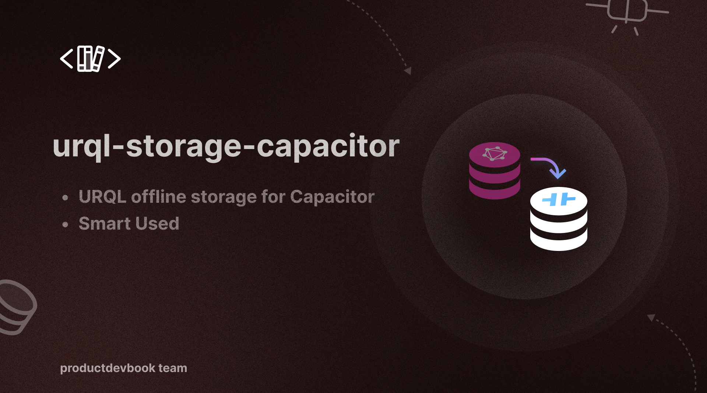

# URQL Storage Capacitor




<p>
      <a href="https://www.npmjs.com/package/urql-storage-capacitor"></a>
      <a href="https://www.npmjs.com/package/urql-storage-capacitor"></a>
      <a href="./LICENSE"></a>
      <a href="https://github.com/productdevbookcom/urql-storage-capacitor">
       </a>
</p>


## Installation

```bash
pnpm install urql-storage-capacitor
```

`urql-storage-capacitor` is a Graphcache offline storage for Capacitor.

It is compatible for both plain Capacitor (including managed workflow), but it has a two peer dependencies - [Capacitor Preferences](https://capacitorjs.com/docs/apis/preferences) and [Capacitor Network](https://capacitorjs.com/docs/apis/network) - which must be installed separately. AsyncStorage will be used to persist the data, and NetInfo will be used to determine when the app is online and offline.

## Quick Start Guide

Install Capacitor Preferences[https://capacitorjs.com/docs/apis/preferences] and Capacitor Network[https://capacitorjs.com/docs/apis/network] alongside `urql-storage-capacitor`:

Install `urql-storage-capacitor` alongside `urql` and `@urql/exchange-graphcache`:

```sh
pnpm add urql-storage-capacitor
# or 
yarn add urql-storage-capacitor
# or
npm install --save urql-storage-capacitor
```

Then add it to the offline exchange:

```js
import { createClient, dedupExchange, fetchExchange } from 'urql'
import { offlineExchange } from '@urql/exchange-graphcache'
import { makeAsyncStorage } from 'urql-storage-capacitor'

const storage = makeAsyncStorage({
  dataKey: 'graphcache-data', // The AsyncStorage key used for the data (defaults to graphcache-data)
  metadataKey: 'graphcache-metadata', // The AsyncStorage key used for the metadata (defaults to graphcache-metadata)
  maxAge: 7, // How long to persist the data in storage (defaults to 7 days)
})

const cache = offlineExchange({
  schema,
  storage,
  updates: {
    /* ... */
  },
  optimistic: {
    /* ... */
  },
})

const client = createClient({
  url: 'http://localhost:3000/graphql',
  exchanges: [dedupExchange, cache, fetchExchange],
})
```


## License

This project is licensed under the [MIT License](LICENSE).